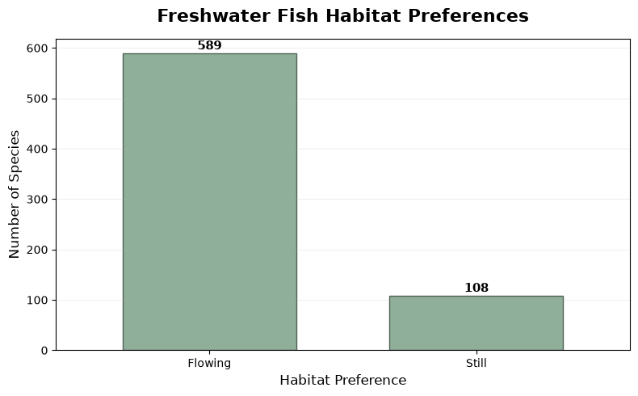
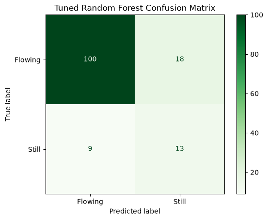

# Projects

This section showcases my data science projects, research questions, and data stories created throughout my coursework.

---

## 1. Pokémon TCG 2025 Market Price Analysis

### How much did 2025 Pokémon TCG products rise above retail?

For this project, I analyzed Pokémon TCG products released in 2025 to compare retail price baselines with secondary market prices. I used Python, pandas, API data, and data visualizations to determine which sets and product types experienced the largest price markups.

**Tools Used:**  
`Python` · `Pandas` · `Matplotlib` · `Jupyter Notebook` · `API`

**Skills Demonstrated:**  
Data Collection · Data Cleaning · Data Analysis · Data Visualization

Frimpong, E. A., & Angermeier, P. L. (2009). Fish traits: A database of ecological and life-history traits of freshwater fishes of the United States. *Fisheries, 34*(10), 487–495. https://doi.org/10.1577/1548-8446-34.10.487

Goldstein, R. M., & Meador, M. R. (2004). Comparisons of fish species traits from small streams to large rivers. *Transactions of the American Fisheries Society, 133*(4), 971–983. https://doi.org/10.1577/T03-080.1

Goldstein, R. M., & Meador, M. R. (2005). Multilevel assessment of fish species traits to evaluate habitat degradation in streams of the Upper Midwest. *North American Journal of Fisheries Management, 25*(1), 180–194. https://doi.org/10.1577/M04-042.1

### [ View Full Pokémon TCG Analysis →](https://github.com/LockdownKam/Data-Structures-Portfolio/blob/main/pokemon_tcg_market_analysis.ipynb)

---

### Project Highlights

- Analyzed **7 Pokémon TCG sets released in 2025**
- Compared retail price baselines with secondary market prices
- Examined differences between multiple sealed product types
- Calculated dollar price differences and percentage markups
- Created visualizations to compare sets and product categories

---

## 2. Freshwater Fish Habitat Prediction

### Can machine learning predict whether a freshwater fish species prefers flowing-water or still-water habitats?

For this project, I used the FishTraits dataset to investigate whether biological and environmental characteristics can be used to predict freshwater fish habitat preference. I used body size, feeding ecology, life-history traits, and environmental characteristics to compare multiple machine-learning models.

### Background & Context

Freshwater fish species differ in their habitat preferences based on biological and ecological characteristics. Traits such as body size, feeding behavior, reproductive strategies, and environmental conditions can help describe how species interact with their habitats. Previous research has shown that fish traits can be useful for studying ecological patterns and responses to habitat conditions (Frimpong & Angermeier, 2009; Goldstein & Meador, 2004; Goldstein & Meador, 2005).

Predicting whether a species is more associated with flowing-water or still-water habitats can help demonstrate how machine learning can identify patterns between species traits and habitat preference. This project uses these relationships as a classification problem rather than attempting to determine that any individual trait causes a particular habitat preference.

**Tools Used:**  
`Python` · `Pandas` · `Matplotlib` · `Scikit-learn` · `Jupyter Notebook`

**Skills Demonstrated:**  
Data Cleaning · Exploratory Data Analysis · Feature Selection · Classification · Model Evaluation · Cross-Validation · Hyperparameter Tuning

### [View Full Fish Habitat Analysis →](https://github.com/LockdownKam/Data-Structures-Portfolio/blob/main/Aquarium_Research_Project.ipynb)

### Variables Used

The final model used 13 biological and environmental features:

| Variable | Description |
|---|---|
| `MAXTL` | Maximum total body length |
| `MATUAGE` | Age at maturity |
| `LONGEVITY` | Longevity of the species |
| `FECUNDITY` | Reproductive output |
| `BENTHIC` | Benthic or bottom-feeding behavior |
| `SURWCOL` | Surface or water-column feeding behavior |
| `ALGPHYTO` | Feeding on algae or phytoplankton |
| `MACVASCU` | Feeding on aquatic vascular plants |
| `DETRITUS` | Feeding on detritus |
| `INVLVFSH` | Feeding on invertebrates |
| `FSHCRCRB` | Feeding on larger prey such as fish, crayfish, crabs, or frogs |
| `MINTEMP` | 30-year average minimum January temperature at the species' range centroid |
| `MAXTEMP` | 30-year average maximum July temperature at the species' range centroid |

### Data & Exploration

The FishTraits dataset contains 809 freshwater fish species and 110 original variables. Each row represents one fish species and includes information about body size, life history, feeding ecology, habitat preference, and environmental characteristics.

For this project, I created the target variable `HABITAT_TARGET` to classify species as either **Flowing** or **Still** based on the habitat preference variables in FishTraits. Species without a clear flowing-water or still-water preference were excluded, leaving 697 species for modeling.

The final dataset contained 589 flowing-water species and 108 still-water species, showing a noticeable class imbalance. Exploratory analysis also showed differences in body size and feeding ecology between the two habitat groups. Still-water species generally had a higher median maximum body length and were more commonly associated with surface/water-column feeding and feeding on larger prey.

Several predictor variables contained missing values. These values were handled using median imputation within the machine-learning pipelines so that information from the test set was not used during model training.

### Model Development

I split the data into 80% training data and 20% testing data using a stratified split so that the proportion of flowing-water and still-water species was maintained in both sets.

I first created a baseline model that always predicted the majority class. The baseline achieved 84.3% accuracy but only 50.0% balanced accuracy, showing why accuracy alone could be misleading because of the class imbalance.

I then compared two classification models: a **Decision Tree** and a **Random Forest**. The Decision Tree achieved 62.2% balanced accuracy, while the initial Random Forest achieved 68.1%. I also used 5-fold cross-validation to evaluate the Random Forest across multiple training splits.

Finally, I used hyperparameter tuning to improve the Random Forest. The tuned model was selected as the final model because it provided the best overall balance between predicting flowing-water and still-water species.

### Model Evaluation & Results

Because the dataset was imbalanced, I focused on **balanced accuracy** in addition to regular accuracy. Balanced accuracy gives equal importance to performance on both flowing-water and still-water species instead of allowing the larger flowing-water class to dominate the score.

The tuned Random Forest achieved **80.7% overall accuracy** and **71.9% balanced accuracy**. Although its overall accuracy was lower than the majority-class baseline, it was much better at identifying both habitat classes.

For still-water species, recall improved from **45% with the original Random Forest to 59% with the tuned model**. In the final confusion matrix, the model correctly classified 100 of 118 flowing-water species and 13 of 22 still-water species.

Based on these results, I selected the tuned Random Forest as my final model because it provided the strongest performance across both habitat classes rather than simply maximizing overall accuracy.

### Model Interpretation & Insights

To better understand the final Random Forest model, I used permutation importance to measure how much each feature contributed to its predictions. The most influential feature was **maximum temperature**, followed by **fecundity** and **surface/water-column feeding behavior**. Minimum temperature and feeding on larger prey also contributed to the model.

I also examined the species that the model classified incorrectly. The final model made 27 incorrect predictions, including species such as Atlantic sturgeon, striped bass, sauger, and mountain whitefish. These errors show that habitat preference cannot always be explained by the selected biological and environmental characteristics alone.

Overall, the results suggest that temperature-related environmental characteristics, reproductive traits, and feeding ecology contain useful information for predicting habitat preference. However, these relationships should not be interpreted as causal because the model only identifies patterns within the FishTraits data.

### Limitations, Ethics & Future Work

One limitation of this project is the class imbalance between flowing-water and still-water species. The model had many more examples of flowing-water species available for training, which may have made the smaller still-water class more difficult to predict accurately.

The habitat target also simplifies habitat preference into only two categories. Fish species can use multiple habitat types, so a binary classification cannot represent every part of a species' habitat behavior. Some predictor variables also contained missing values that required imputation.

Incorrect predictions could misrepresent a species' habitat needs. Because of this, the model should not be used by itself to make conservation, stocking, or habitat-management decisions. The results are better suited for exploring patterns in the FishTraits dataset rather than making decisions about individual species.

Future work could include additional habitat characteristics, more examples of still-water species, and other classification models. These additions could help determine whether habitat preference can be predicted more accurately while reducing the performance difference between the two classes.

### References & Transparency

**Data Source:**  
FishTraits Database — Frimpong, E. A., & Angermeier, P. L. (2009).

**References:**

Frimpong, E. A., & Angermeier, P. L. (2009). Fish traits: A database of ecological and life-history traits of freshwater fishes of the United States. *Fisheries, 34*(10), 487–495. https://doi.org/10.1577/1548-8446-34.10.487

Goldstein, R. M., & Meador, M. R. (2004). Comparisons of fish species traits from small streams to large rivers. *Transactions of the American Fisheries Society, 133*(4), 971–983. https://doi.org/10.1577/T03-080.1

Goldstein, R. M., & Meador, M. R. (2005). Multilevel assessment of fish species traits to evaluate habitat degradation in streams of the Upper Midwest. *North American Journal of Fisheries Management, 25*(1), 180–194. https://doi.org/10.1577/M04-042.1

### Code & AI Transparency

[View the complete Jupyter Notebook and project code on GitHub →](https://github.com/LockdownKam/Data-Structures-Portfolio/blob/main/Aquarium_Research_Project.ipynb)

I used ChatGPT (OpenAI, GPT-5.6) as a support tool while completing this project. I used it to help troubleshoot Python errors, understand machine-learning concepts and evaluation metrics, improve the fluency and organization of my code, and improve the clarity of some written explanations. I wrote, ran, and reviewed the code used in the analysis and examined the model results to make the final decisions presented in the project.

---
